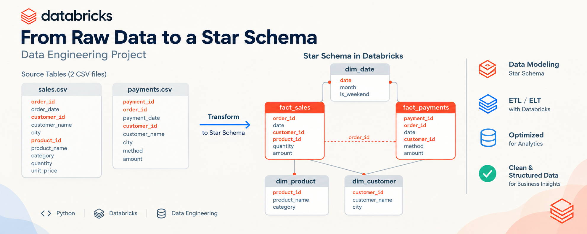

# Databricks Sales & Payments Data Modeling



A Data Engineering and Analytics Engineering project demonstrating the end-to-end transformation of raw, denormalized CRM/POS transactional data into a dimensional Star Schema in Databricks Lakehouse using Apache Spark, PySpark, Delta Lake, and Unity Catalog.

---

## Overview

In enterprise e-commerce and retail environments, sales orders and payment settlements are generated by distinct operational systems (CRM, shopping cart engines, payment gateways). Directly joining raw sales lines and payment logs frequently causes Cartesian product inflation, double counting, and distorted financial reporting.

This project implements an analytical Lakehouse data model in **Databricks**. It reads raw transactional CSV files from a **Unity Catalog Volume**, inspects and validates schemas, defines dimensional entities, and establishes a **Star Schema** with conformed dimensions. The resulting Delta tables enable accurate, high-performance analytical SQL queries—specifically illustrating how to reconcile sales revenue against payment collections without fan-out errors.

---

## Project Goals

- **Ingest Raw Data:** Load denormalized sales and payment CSV files directly from Unity Catalog Volumes.
- **Source Schema Validation:** Inspect Spark-inferred schemas, verify data types, and understand initial data distributions.
- **Data Quality Validation:** Conduct comprehensive data profiling, check primary key uniqueness, and verify table grains.
- **Dimensional Modeling:** Extract and build entity dimensions (`dim_customer`, `dim_product`) and generate a standard calendar dimension (`dim_date`).
- **Implement a Star Schema:** Build two distinct fact tables (`fact_sales` and `fact_payments`) persisted as Delta Lake tables in Unity Catalog.
- **Referential Integrity Testing:** Validate that all foreign keys in fact tables resolve cleanly to their respective dimensions with zero orphaned records.
- **Prevent Fan-Out / Double Counting:** Demonstrate the mathematical risk of joining multi-line sales with multi-transaction payments directly, and implement the order-level pre-aggregation pattern.
- **Analytical Reporting:** Execute SQL queries answering key business questions regarding revenue, payment methods, customer debt, and geographic exposure.

---

## Architecture

The project follows a Lakehouse architecture within Databricks:

```text
┌─────────────────────────────────┐
│     Raw CSV Source Layer        │
│   /Volumes/data_lab/shop/raw/   │
│   • sales.csv   • payments.csv  │
└────────────────┬────────────────┘
                 │
                 ▼
┌─────────────────────────────────┐
│     Spark / PySpark Engine      │
│  • Schema inference             │
│  • Entity deduplication         │
│  • Calendar sequence generation │
│  • Data quality assertions      │
└────────────────┬────────────────┘
                 │
                 ▼
┌─────────────────────────────────┐
│    Delta Lake Analytical Model  │
│         data_lab.shop           │
│  • dim_customer  • dim_product  │
│  • dim_date                     │
│  • fact_sales    • fact_payments│
└────────────────┬────────────────┘
                 │
                 ▼
┌─────────────────────────────────┐
│      SQL Analytics & BI         │
│  • Slicing & dicing by dims     │
│  • Safe order-level comparisons │
│  • Debt & revenue calculations  │
└─────────────────────────────────┘
```

* **Raw Storage:** Source files are stored as immutable files inside a Unity Catalog Volume (`/Volumes/data_lab/shop/raw/`).
* **Processing Engine:** Apache Spark / PySpark transforms raw DataFrames, creates dimensions and fact tables, and performs integrity checks.
* **Analytical Storage:** Structured analytical tables are saved as Delta tables in catalog `data_lab`, schema `shop`.
* **Analytical Consumption:** Databricks SQL queries perform dimensional aggregation and reconciliation.

*(Note: The project executes directly as a single-notebook Lakehouse data modeling workflow. It does not implement multi-hop Bronze/Silver/Gold Delta table stages, which is documented under Future Improvements).*

---

## Source Data

The raw layer consists of two CSV exports:

| File | Purpose | Grain | Key Columns |
|:---|:---|:---|:---|
| `sales.csv` | Captures order line items from the sales/checkout system. | **One product line within an order** | `order_id`, `order_date`, `customer_id`, `customer_name`, `city`, `product_id`, `product_name`, `category`, `quantity`, `unit_price` |
| `payments.csv` | Captures financial transaction events from billing / payment processors. | **One payment transaction** | `payment_id`, `order_id`, `payment_date`, `customer_id`, `customer_name`, `city`, `method`, `amount` |

---

## Data Model

The analytical model resides in schema `data_lab.shop` and consists of 3 dimension tables and 2 fact tables:

### Fact Tables

#### `fact_sales`
* **Grain:** Exactly one product line within one order.
* **Columns:**
  * `order_id` (`int`): Business identifier for the customer order.
  * `date` (`date`): Order placement date (FK to `dim_date.date`).
  * `customer_id` (`int`): Purchasing customer (FK to `dim_customer.customer_id`).
  * `product_id` (`int`): Purchased product (FK to `dim_product.product_id`).
  * `quantity` (`int`): Number of units purchased.
  * `unit_price` (`int`): Unit price at sale time.
  * `amount` (`int`): Line revenue calculated as `quantity * unit_price`.

#### `fact_payments`
* **Grain:** Exactly one payment transaction event.
* **Columns:**
  * `payment_id` (`int`, PK): Unique transaction identifier.
  * `order_id` (`int`): Order identifier associated with the payment.
  * `date` (`date`): Payment settlement date (FK to `dim_date.date`).
  * `customer_id` (`int`): Paying customer (FK to `dim_customer.customer_id`).
  * `method` (`string`): Payment method used (`картка`, `готівка`, `Apple Pay`).
  * `amount` (`int`): Amount received in local currency (UAH).

### Dimension Tables

#### `dim_customer`
* **Purpose:** Conformed customer dimension shared across sales and payment processes.
* **Columns:** `customer_id` (`int`, PK), `customer_name` (`string`), `city` (`string`).
* **Source:** Extracted from both `sales.csv` and `payments.csv` using `union().distinct()`.

#### `dim_product`
* **Purpose:** Catalog dimension providing product descriptions and categories.
* **Columns:** `product_id` (`int`, PK), `product_name` (`string`), `category` (`string`).
* **Scope:** Linked exclusively to `fact_sales` (payments do not contain product line detail).

#### `dim_date`
* **Purpose:** Conformed enterprise calendar dimension.
* **Columns:** `date` (`date`, PK), `month` (`string`), `day_name` (`string`), `is_weekend` (`boolean`).
* **Scope:** Generated synthetically for `2026-07-01` through `2026-09-30` (92 days) and linked to both `fact_sales` and `fact_payments`.

---

## Data Modeling Decisions

1. **Separation of Distinct Business Processes:**
   Sales ordering and payment collection happen at different moments in time and have different business grains. Combining them into a single table would cause sparse columns, null attributes, and grain ambiguity.
2. **Conformed Dimensions (`dim_customer`, `dim_date`):**
   By sharing customer and calendar dimensions across both facts, the business can slice sales revenue and payment collections using consistent customer demographics and time periods.
3. **Product Dimension Belongs Only to Sales:**
   In real-world payment settlement logs, payment gateways receive order totals or installment amounts; they do not track individual line items. Therefore, `dim_product` only connects to `fact_sales`.
4. **The Fan-Out & Double Counting Problem:**
   Orders often contain multiple line items and are paid in multiple installments. If an order has **2 sales lines** and **2 payment installments**, a direct join on `order_id` produces $2 \times 2 = 4$ joined records.
   * Every sales line amount is summed twice.
   * Every payment amount is summed twice.
   * In order `1020` (which has 3 sales lines and 3 payment transactions), a direct join generates 9 rows, inflating both revenue and collections by 300%.
5. **The Order-Level Pre-Aggregation Pattern:**
   Whenever sales and payments must be reconciled (e.g., calculating debt or fulfillment status), each fact table is first aggregated independently to the order level (`order_id`) before joining:
   ```text
   fact_sales    ──► GROUP BY order_id ──► (1 row per order) ┐
                                                             ├─► SAFE 1:1 JOIN ON order_id
   fact_payments ──► GROUP BY order_id ──► (1 row per order) ┘
   ```

---

## Data Quality & Validation

The project executes rigorous validation checks directly in Spark SQL. Actual results obtained from the implementation:

### 1. Table Row Counts
Validation query in Step 9.4 confirmed the following table volumes:

| Entity | Table Type | Recorded Count | Description |
|:---|:---|:---|:---|
| `dim_customer` | Dimension | **12** | Distinct customers identified across both source files |
| `dim_product` | Dimension | **10** | Unique catalog SKUs |
| `dim_date` | Dimension | **92** | Consecutive calendar days (`2026-07-01` to `2026-09-30`) |
| `fact_sales` | Fact | **122** | Total individual order lines |
| `fact_payments` | Fact | **74** | Total payment transaction records |

### 2. Fact Grain & Uniqueness Tests
- **`fact_sales` Grain Validation (`order_id + product_id`):** Grouping by `(order_id, product_id)` with `HAVING count(*) > 1` returned **0 rows**, proving every line item is uniquely identifiable.
- **`fact_payments` Primary Key Validation (`payment_id`):** Grouping by `payment_id` with `HAVING count(*) > 1` returned **0 rows**, confirming no duplicated transaction IDs.

### 3. Referential Integrity Checks (Orphan Key Detection)
Left joins between fact tables and dimensions filtering on `dimension.key IS NULL` returned **0 orphan records** across all relationships:
- `fact_sales` $\rightarrow$ `dim_customer`: **0 orphaned foreign keys**
- `fact_sales` $\rightarrow$ `dim_product`: **0 orphaned foreign keys**
- `fact_payments` $\rightarrow$ `dim_customer`: **0 orphaned foreign keys**
- `fact_sales` $\rightarrow$ `dim_date`: **0 orphaned foreign keys**
- `fact_payments` $\rightarrow$ `dim_date`: **0 orphaned foreign keys**

### 4. Fact-to-Fact Fan-Out Demonstration
Step 9.12 evaluated orders with multiple line items and multiple payments:
- Multiple orders exhibited M:N relationships (e.g., Order `1020` has 3 sales lines and 3 payment transactions; Order `1031` has 3 sales lines and 3 payments; Orders `1022`, `1011`, `1037` have 3 sales lines and 2 payments).
- This verified why direct row-level joins would corrupt measure calculations without order-level pre-aggregation.

---

## Analytical Queries

The notebook contains 4 analytical SQL queries demonstrating business reporting capabilities:

### Query 1: Revenue by City, Month, and Product Category
* **Business Question:** Which product categories generate the most revenue across different cities and months?
* **Grain of Result:** One row per `city + month + category`.
* **Tables Used:** `fact_sales`, `dim_customer`, `dim_date`, `dim_product`.
* **Design Rationale:** Demonstrates classical star schema joining: measures come from the fact table, while slice-and-dice dimensions come from dimension tables.

### Query 2: Payments by Month and Payment Method
* **Business Question:** What is the total transaction volume and count for each payment instrument by month?
* **Grain of Result:** One row per `month + method`.
* **Tables Used:** `fact_payments`, `dim_date`.
* **Design Rationale:** Joins payment facts to the calendar dimension and aggregates on the degenerate dimension `method`. Top instruments include `картка` (bank card) and `Apple Pay`.

### Query 3: Partially Paid Orders
* **Business Question:** Which orders have an unpaid balance (debt), and how much remains to be collected?
* **Grain of Result:** One row per unpaid or partially paid `order_id`.
* **Tables Used:** `fact_sales`, `fact_payments`, `dim_customer`.
* **Design Rationale:** Uses Common Table Expressions (CTEs) to aggregate sales and payments independently to the order level before joining. Implements `LEFT JOIN` and `COALESCE(paid, 0)` so orders with zero payments are included. Top debt orders identified include Order `1019` (40,950 UAH debt), Order `1041` (23,400 UAH debt), and Order `1023` (14,850 UAH debt).

### Query 4: Outstanding Debt by City
* **Business Question:** Which cities carry the highest cumulative customer debt?
* **Grain of Result:** One row per `city`.
* **Tables Used:** `fact_sales`, `fact_payments`, `dim_customer`.
* **Design Rationale:** Safely joins order-level CTE aggregates of sales and payments, matches customer municipality via `dim_customer`, and groups by city. Identifies cities with highest exposure (e.g., Одеса with 40,950 UAH debt, Львів with 27,775 UAH debt, Дніпро with 19,950 UAH debt; while Харків has 0 UAH debt).

---

## Key Learning Outcomes

- **Lakehouse Storage & Governance:** Working with Databricks Unity Catalog Volumes for raw file landing and Delta tables for analytical query access.
- **Dimensional Modeling in Spark:** Decoupling denormalized transaction logs into Kimball-style Star Schemas using PySpark DataFrames.
- **Conformed Dimensions:** Understanding entity extraction across multiple upstream datasets (`dim_customer`) and synthetic calendar generation (`dim_date`).
- **Data Quality Assertions:** Testing grain validity, uniqueness, and referential integrity using Spark SQL before publishing analytical tables.
- **Preventing Fan-Out in BI:** Recognizing Cartesian explosion traps when joining multiple transaction-level fact tables and executing order-level pre-aggregation patterns.

---

## Technologies

| Technology | Role / Usage in Project |
|:---|:---|
| **Databricks** | Unified analytics platform for development, compute, and execution |
| **Apache Spark / PySpark** | Distributed data processing engine for schema validation and DataFrame transformations |
| **Delta Lake** | High-performance ACID storage layer for analytical dimensions and facts |
| **Databricks Unity Catalog** | Data governance, catalog namespace (`data_lab.shop`), and Volume storage (`raw`) |
| **Databricks SQL** | Query language for analytical queries, model validation, and schema definitions |
| **Jupyter Notebook (.ipynb)** | Interactive development and documentation medium |

---

## Repository Structure

```text
databricks-sales-payments-data-modeling/
│
├── README.md                              # Main portfolio documentation
├── LICENSE                                # MIT License
├── .gitignore                             # Git exclusion configuration
│
├── assets/
│   └── star_schema_banner.png             # Project banner and Star Schema architecture diagram
│
├── notebooks/
│   └── sales_payments_data_modeling.ipynb # Primary Databricks Notebook (PySpark & SQL)
│
├── docs/
│   └── data_model.md                      # Detailed technical data model documentation & ER diagram
│
├── data/
│   └── README.md                          # Data dictionary and Unity Catalog Volume guide
│
└── .github/
    └── workflows/
        └── README.md                      # Note on CI/CD design & future automation
```

---

## How to Reproduce

### Prerequisites
1. Access to a **Databricks Workspace** enabled with **Unity Catalog**.
2. A running compute cluster with Spark 3.x / Databricks Runtime.
3. Target catalog `data_lab` and schema `shop` created:
   ```sql
   CREATE CATALOG IF NOT EXISTS data_lab;
   CREATE SCHEMA IF NOT EXISTS data_lab.shop;
   CREATE VOLUME IF NOT EXISTS data_lab.shop.raw;
   ```

### Execution Steps
1. **Upload Source Files:**
   Upload `sales.csv` and `payments.csv` into the Databricks Unity Catalog Volume:
   ```text
   /Volumes/data_lab/shop/raw/sales.csv
   /Volumes/data_lab/shop/raw/payments.csv
   ```
2. **Import Notebook:**
   Import [`notebooks/sales_payments_data_modeling.ipynb`](notebooks/sales_payments_data_modeling.ipynb) into your Databricks workspace.
3. **Run All Cells:**
   Execute the notebook sequentially:
   - Reads CSV files from `/Volumes/data_lab/shop/raw/`.
   - Generates dimensions and facts.
   - Saves tables into `data_lab.shop.*` using Delta format.
   - Runs data validation checks and analytical SQL reports.

---

## Limitations / Future Improvements

This repository represents a focused portfolio project on dimensional modeling and data reconciliation. Recommended production enhancements include:

* **Medallion Architecture (Bronze/Silver/Gold):** Structuring raw ingestion into append-only Bronze Delta tables, cleansing and standardizing in Silver, and serving dimensions/facts in Gold.
* **Incremental Processing:** Utilizing Databricks Auto Loader (`cloudFiles`) and Structured Streaming to ingest new orders and payments continuously rather than full overwrites.
* **Automated Data Quality Framework:** Replacing manual validation queries with automated assertions using Great Expectations or Delta Live Tables (DLT) expectations.
* **CI/CD Integration:** Implementing Databricks Asset Bundles (DABs) to automate notebook and pipeline deployments via GitHub Actions.
* **Slowly Changing Dimensions (SCD):** Implementing SCD Type 2 tracking for `dim_customer` to preserve historical customer address/city changes over time.

---

## Author

**Artem Liakh**  
*Product / Data Analyst*  
Specializing in Data Modeling, Analytics Engineering, Databricks Lakehouse, and Business Intelligence.
