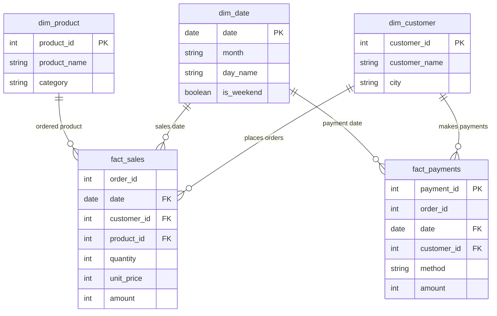

# Star Schema & Dimensional Data Model

This document details the architectural design, table grains, dimensional relationships, and data modeling principles implemented in the Databricks Lakehouse analytical model under the `data_lab.shop` schema.

---

## 1. Dimensional Architecture Overview

The data model follows Kimball's dimensional modeling principles to structure raw, denormalized CRM and POS transaction logs into a Star Schema optimized for high-performance analytical queries and business intelligence.

The architecture isolates distinct business processes into independent fact tables and provides shared, conformed dimensions for cross-process slicing and dicing.



> **Design Rule:** Notice that there is **no direct foreign key relationship between `fact_sales` and `fact_payments`**. While both fact tables share the business identifier `order_id`, they represent separate business processes occurring at different grains.

---

## 2. Table Specifications and Grains

### Fact Tables

#### `fact_sales`
* **Business Process:** Sales order generation and line item fulfillment.
* **Grain:** Exactly **one product line within one order**.
* **Primary Business Key:** Composite `(order_id, product_id)`.
* **Foreign Keys:** `date` -> `dim_date.date`, `customer_id` -> `dim_customer.customer_id`, `product_id` -> `dim_product.product_id`.
* **Measures:**
  * `quantity`: Number of product units sold.
  * `unit_price`: Price per single unit.
  * `amount`: Calculated line item revenue (`quantity × unit_price`).

#### `fact_payments`
* **Business Process:** Financial settlement and transaction processing.
* **Grain:** Exactly **one payment transaction event**.
* **Primary Key:** `payment_id`.
* **Foreign Keys:** `date` -> `dim_date.date`, `customer_id` -> `dim_customer.customer_id`.
* **Business Identifier:** `order_id` (identifies which order the payment settles).
* **Degenerate Dimension:** `method` (payment instrument: `картка`, `готівка`, `Apple Pay`).
* **Measure:**
  * `amount`: Actual payment amount settled in the transaction.

---

### Dimension Tables

#### `dim_customer` (Conformed Dimension)
* **Purpose:** Provides a single, unified source of truth for customer demographic and geographic attributes.
* **Scope:** Conformed across both `fact_sales` and `fact_payments`.
* **Construction:** Formed by unioning unique customer records from both `sales` and `payments` sources (`union().distinct()`), ensuring that customers present in either transaction stream are captured without duplicate entity keys.
* **Columns:**
  * `customer_id` (PK): Unique customer identifier.
  * `customer_name`: Full customer name.
  * `city`: Customer municipality / billing city.

#### `dim_product`
* **Purpose:** Stores product catalog attributes.
* **Scope:** Connected exclusively to `fact_sales`.
* **Design Decision:** Product attributes exist only within order lines in the sales system. Payment records do not capture item-level details (only the settlement amount against the order); therefore, `dim_product` is intentionally isolated from `fact_payments`.
* **Columns:**
  * `product_id` (PK): Unique SKU / product identifier.
  * `product_name`: Title of the product.
  * `category`: Product grouping / category.

#### `dim_date` (Conformed Dimension)
* **Purpose:** Standard enterprise calendar dimension for time-series analysis and cohort aggregation.
* **Scope:** Conformed across both `fact_sales` and `fact_payments`.
* **Construction:** Generated synthetically via Spark SQL using `sequence(DATE '2026-07-01', DATE '2026-09-30')` and `explode()` to ensure calendar continuity regardless of transactional gaps.
* **Columns:**
  * `date` (PK): Calendar date (`YYYY-MM-DD`).
  * `month`: Format `YYYY-MM`.
  * `day_name`: Day of week (e.g., `Monday`, `Tuesday`).
  * `is_weekend`: Boolean flag (`true` if Saturday or Sunday).

---

## 3. Critical Modeling Principle: Preventing Fact-to-Fact Fan-Out

### The Fan-Out Problem

A critical mistake in data modeling is joining two fact tables directly on a shared business identifier (such as `order_id`) at their raw transaction grains.

Because an order can contain multiple product lines in `fact_sales` and multiple payment installments in `fact_payments`, joining them directly creates a **Many-to-Many Cartesian explosion** for each order.

#### Concrete Example:

Consider Order `1000`:
* In `fact_sales`: 2 product lines (Notebook Air 13 for 32,000 UAH + Notebook Pro 14 for 48,000 UAH). Total order value = **80,000 UAH**.
* In `fact_payments`: 2 payment transactions (Installment 1 of 24,000 UAH + Installment 2 of 56,000 UAH). Total paid = **80,000 UAH**.

If joined directly:
```sql
-- INCORRECT PATTERN: Direct Fact-to-Fact Join
SELECT
    s.order_id,
    SUM(s.amount) AS total_sales,
    SUM(p.amount) AS total_payments
FROM fact_sales s
JOIN fact_payments p ON s.order_id = p.order_id
WHERE s.order_id = 1000
GROUP BY s.order_id;
```

**What happens?**
* 2 sales rows × 2 payment rows = **4 joined rows**.
* Each sales row is duplicated across both payments: `total_sales` becomes **160,000 UAH** (2× double counted).
* Each payment row is duplicated across both sales items: `total_payments` becomes **160,000 UAH** (2× double counted).
* For orders with 3 items and 3 payments (e.g., Order `1020`), the Cartesian product yields 9 rows, causing a **300% inflation** in calculated measures.

---

### The Order-Level Pre-Aggregation Pattern

To safely compare sales and payment metrics, both fact tables must first be aggregated independently to the exact same business grain (`order_id`) before joining.

```sql
-- CORRECT PATTERN: Pre-aggregation to Order Grain
WITH ordered AS (
    SELECT
        order_id,
        customer_id,
        SUM(amount) AS ordered
    FROM data_lab.shop.fact_sales
    GROUP BY order_id, customer_id
),
paid AS (
    SELECT
        order_id,
        SUM(amount) AS paid,
        COUNT(*) AS payments
    FROM data_lab.shop.fact_payments
    GROUP BY order_id
)
SELECT
    o.order_id,
    c.customer_name,
    c.city,
    o.ordered,
    COALESCE(p.paid, 0) AS paid,
    o.ordered - COALESCE(p.paid, 0) AS debt,
    COALESCE(p.payments, 0) AS payments
FROM ordered o
LEFT JOIN paid p
    ON p.order_id = o.order_id
JOIN data_lab.shop.dim_customer c
    ON c.customer_id = o.customer_id;
```

### Key Rules of This Pattern:
1. **Grain Alignment:** Grouping by `order_id` in CTEs collapses both sides to a `1 : 1` cardinality per order.
2. **`LEFT JOIN` Preservation:** Joining `ordered` to `paid` using `LEFT JOIN` guarantees that orders with zero payments are not dropped from reporting.
3. **`COALESCE` Handling:** Null payment sums for unpaid orders are safely replaced with `0` so that `ordered - paid` correctly computes total outstanding debt.
4. **Dimension Slicing:** Customer and geographic attributes are attached after order-level matching through the conformed `dim_customer` dimension.
